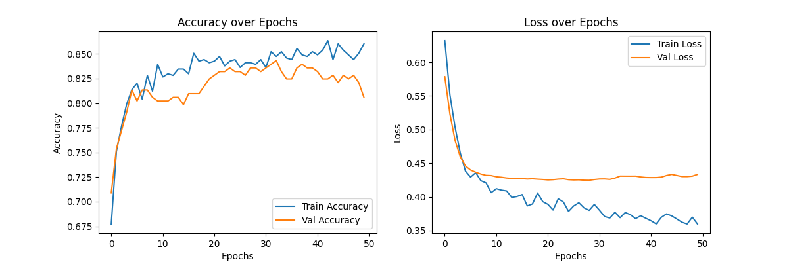

# 🛳️ Titanic Survivor Predictor
This is my Deep Learning Final Mission project: A full on end-to-end app predicting Titanic passenger survival.
Includes:
- A neural network trained on Titanic data.
- A Flask API serving the model.
- A simple web page for interactive predictions (yes, you can play with it 😏).

---

## 🧱 Project Structure

```
ss80titanic_app/
├─ app.py                  # Flask app (API + front-end)
├─ train_titanic.py        # Training script (saves preprocessor & model)
├─ requirements.txt        # Python dependencies
├─ data/
│  ├─ titanic.csv          # Original dataset
│  └─ cleaned_titanic.csv  # Preprocessed dataset
├─ model/
│  ├─ titanic_preprocessor.joblib    # Saved preprocessor
│  ├─ titanic_model.h5     # Trained neural network
│  └─ acc_loss_epochs.png  # Accuracy & Loss over Epochs
└─ web/
   ├─ index.html           # Web interface
   ├─ main.js              # Frontend logic
   └─ styles.css           # Frontend styling   
```

---

## ⚙️ Setup

Requires **Python 3.8+** installed.
```bash
cd ss80titanic_app

# Windows (PowerShell)
python -m venv .venv
.\.venv\Scripts\Activate.ps1

# macOS/Linux
python3 -m venv .venv
source .venv/bin/activate

pip install -r requirements.txt
```

---

## 🧠 Train the Model
1. Make sure Titanic dataset is in `data/titanic.csv`.
Columns needed:
```
Survived, Pclass, Sex, Age, SibSp, Parch, Fare, Embarked
```
2. Train the model:
   ```bash
   python train_titanic.py
   ```
3. Preprocessed dataset saved as `data/cleaned_titanic.csv`
4. Outputs in `model/`:
- `titanic_preprocessor.joblib` → Preprocessor
- `titanic_model.h5` → Trained neural network
- `acc_loss_epochs.png` → Accuracy & Loss over Epochs 

---

## 📊 Model Training History

Here’s how the neural network performed over epochs:



---

## 🚀 Running the Web App

Start the Flask server:
```bash
python app.py
```
Open http://127.0.0.1:5000 in your browser.

Enter passenger details, click Predict, and see the survival probability.

---
## 🛠 Troubleshooting

- **`data/titanic.csv` not found** → Make sure the dataset is in `data/`.
- **`titanic_model.h5` or `titanic_preprocessor.joblib` missing** → Run `python train_titanic.py` first.
- **Port already in use** → Change the port `app.py`, e.g. `app.run(port=5001)`.
- **TensorFlow warnings** → Usually safe, can ignore unless execution breaks.

---